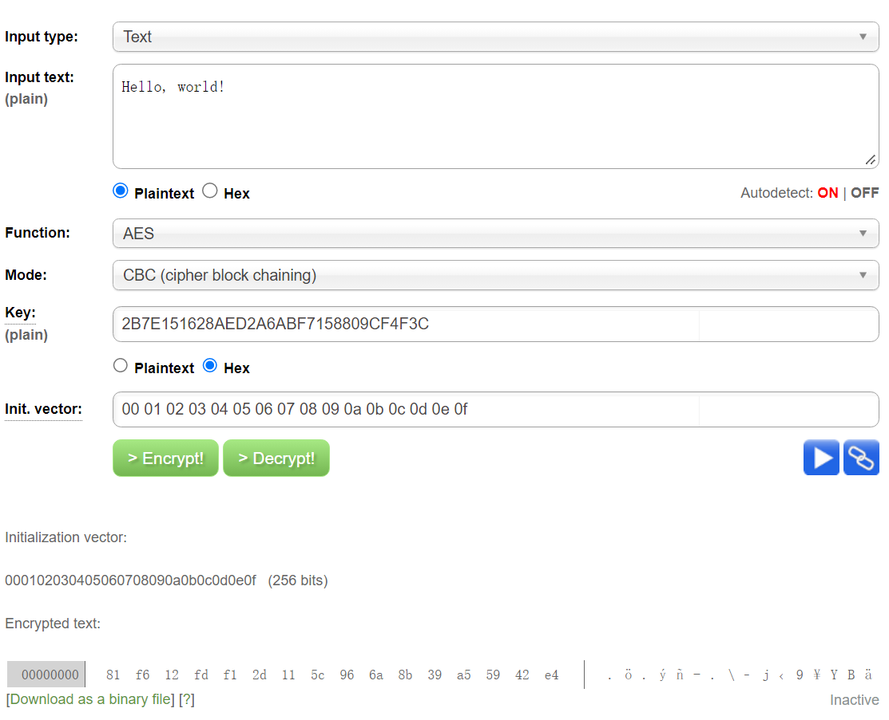
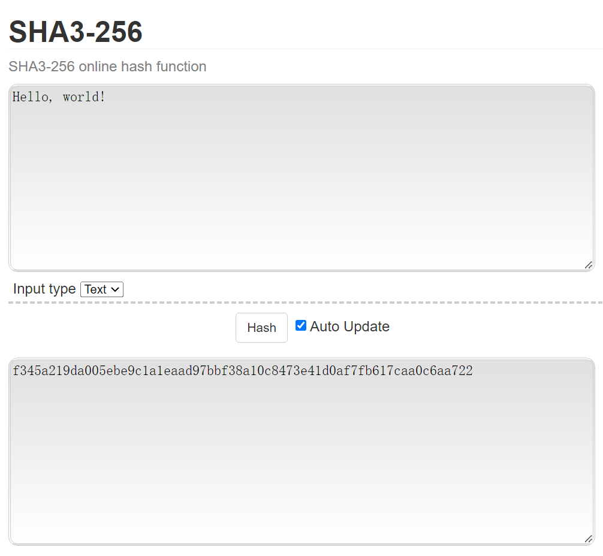

## Modern Cryptography Assignment 2

### Part 1. AES

Implemented AES-128-CBC

Code: Compile aes.cpp using: `g++ aes.cpp -O3 -o aes`

Run: `./aes`

### 1. Implementation Process

AES encryption:

State=Plaintext AddRoundKey(State, Key0)

For i=0 to r-1

Subbytes(State) ShiftRows(State) MixColumns(State)
AddRoundKey(State, RoundKeyi)

End for

Subbytes(State)
ShiftRows(State)
AddRoundKey(State, RoundKeyr)
Ciphertext=State

AES decryption:

State=Ciphertext
AddRoundKey(State, RoundKeyr)

For i=0 to r-1

InvShiftRows(State)
InvSubBytes(State)
AddRoundKey(State, RoundKeyr-i)
InvMixColumns(State)

End for

InvShiftRows(State)
InvSubBytes(State)
AddRoundKey(State, RoundKeyr-i)
Plaintext=State

Applied table lookup acceleration method, i.e., calculations within the 256 field are precomputed, thereafter, each computation is simply a table lookup. Before using this, the code did not achieve 100Mbps (significant impact)

Used the -O3 compilation option for faster code execution (significant impact)

Unrolled some loops for faster code execution (minor impact)

### 2. Correctness Verification

Correctness verification was done with exp0, setting the key and vector, and inputting "Hello, world!" (input0.txt)

Output is
81 f6 12 fd f1 2d 11 5c 96 6a 8b 39 a5 59 42 e4 (output0.txt)

The same result was obtained on a website

### 3. Performance Testing

Size = 10000/1000000/100000000 corresponding to data sizes of 10000 (10^4)/1000000 (10^6)/100000000 (10^8) bytes respectively

Where 100000000 (10^8) bytes is approximately 100MB

exp1/exp2/exp3 are parallel experiments

| Size     | 10000     | 1000000   | 100000000 |
| -------- | --------- | --------- | --------- |
| exp1 encryption | 0.000295s | 0.024989s | 2.494823s |
| exp1 decryption | 0.000286s | 0.024833s | 2.450861s |
| exp2 encryption | 0.000257s | 0.024998s | 2.866403s |
| exp2 decryption | 0.000261s | 0.026231s | 2.643065s |
| exp3 encryption | 0.000252s | 0.026383s | 2.603678s |
| exp3 decryption | 0.000249s | 0.025858s | 2.811757s |
| Avg. encryption | 0.000268s | 0.025457s | 2.654968s |
| Avg. decryption | 0.000265s | 0.025641s | 2.635228s |
| Avg. total | 0.000533s | 0.051097s | 5.290196s |

Therefore, AES-128-CBC can achieve a speed of 18.9M/s, i.e., 151Mbps, which is greater than 100Mbps.

### Part 2. SHA3

Implemented SHA3-256

Code: sha.cpp

Compile using: `g++ sha.cpp -O3 -o sha`

Run: `./sha`

### 1. Implementation Process

The SHA compression process was implemented as explained by the professor, using a class for better code architecture

To implement the Sponge structure, three important functions are used:
padding();
absorbing();
squeezing();

The key computation steps are the round functions, namely the following five steps:
theta; rho; Pi; chi; iota;
The implementation of these functions is also a major part of the computation

Used the -O3 compilation option for faster code execution (significant impact)

### 2. Correctness Verification

Correctness verification was done with exp0, setting the key and vector, and inputting "Hello, world!" (input0.txt)

Output is
f345a219da005ebe9c1a1eaad97bbf38a10c8473e41d0af7fb617caa0c6aa722 (output0.txt)

The same result was obtained on a website

### 3. Performance Testing

Size = 10000/1000000/100000000 corresponding to data sizes of 10000 (10^4)/1000000 (10^6)/100000000 (10^8) bytes respectively

Where 100000000 (10^8) bytes is approximately 100MB

exp1/exp2/exp3 are parallel experiments

| Size | 10000     | 1000000   | 100000000 |
| ---- | --------- | --------- | --------- |
| exp1 | 0.000269s | 0.021595s | 2.21837s  |
| exp2 | 0.000269s | 0.021805s | 2.18439s  |
| exp3 | 0.000275s | 0.021902s | 2.19208s  |
| Avg. | 0.000271s | 0.021767s | 2.19828s  |

Therefore, SHA3-256 can achieve a speed of 45.4M/s, i.e., 363Mbps, which is greater than 100Mbps.
